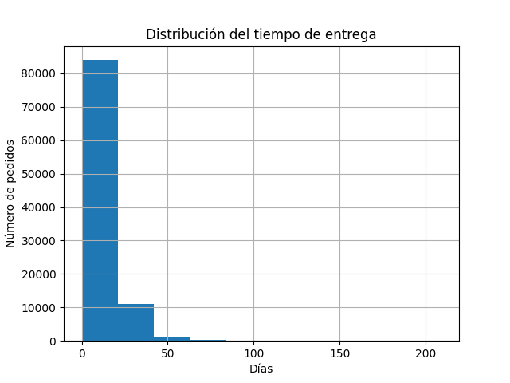

<<<<<<< HEAD
# 📦 Análisis de tiempos de entrega en e-commerce

## 🧩 Descripción

Análisis de tiempos de entrega en un dataset de e-commerce con el objetivo de evaluar la eficiencia logística y detectar posibles retrasos en los pedidos.

---

## 📊 Dataset

Dataset de e-commerce de Olist, que contiene información sobre pedidos, clientes y tiempos de entrega.

---

## 🛠️ Proceso

- Carga de datos desde CSV
- Exploración inicial del dataset
- Limpieza y transformación de datos
- Conversión de variables de fecha a formato datetime
- Creación de la métrica de tiempo de entrega (delivery time)
- Análisis estadístico descriptivo
- Identificación de outliers

---

## 📈 Resultados

- Tiempo medio de entrega: ~12 días  
- Mediana: ~10 días  
- El 75% de los pedidos se entrega en menos de 15 días  
- ~0.6% de pedidos con retrasos superiores a 50 días  

---

## 📊 Visualización

---

## 💡 Conclusiones

El sistema logístico muestra un comportamiento estable, con la mayoría de entregas concentradas entre 10 y 15 días. Los retrasos extremos son poco frecuentes, aunque representan oportunidades de mejora en el proceso operativo.

---

## 🧰 Herramientas utilizadas

- Python  
- Pandas  
- Matplotlib  
- Jupyter Notebook  

---

## 📁 Estructura del proyecto
=======
# ecommerce-analysis
Proyecto de análisis de ventas y comportamiento de clientes. SQL + Power BI.
>>>>>>> a88d45a00edc07491b4ae7b963386b559f160efb
